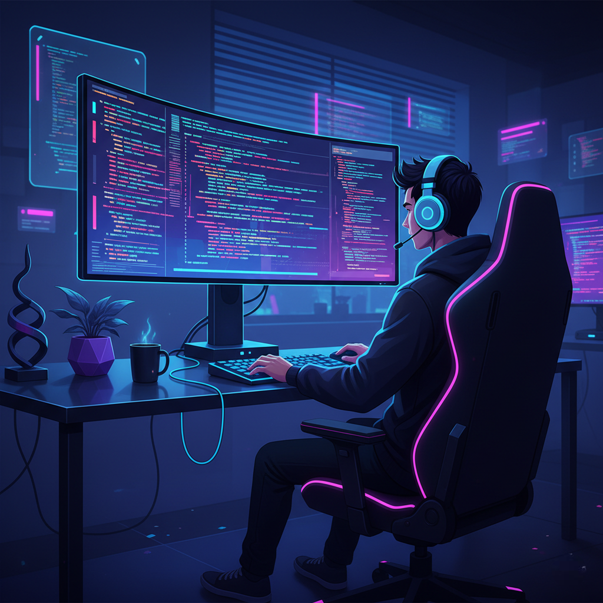

<!-- 🌟 PARTH KADIYA — GITHUB PROFILE README 🌟 -->

<h1 align="center">
  
</h1>

<h3 align="center">🚀 A Passionate MERN Stack Developer from Ahmedabad 🇮🇳</h3>

<!-- Profile Photo -->

  

---

## 🧠 About Me  

💻 I'm an adaptable and detail-oriented **MERN Stack Developer** passionate about building scalable, modern, and user-friendly web applications.  
🎓 **B.Sc. in CA & IT** from *Shreyarth University (2022–2025)* with a CGPI of **8.5**  
💼 Interned at **SwarnimTouch Solutions** (Web Development Intern)  
🌱 Currently learning **Advanced React.js**, **Next.js** & **Laravel**  
🎯 Goal: To become a full-stack developer and create meaningful digital experiences.

---

## ⚙️ Tech Stack (Icons Only)

  

---

## 🚀 Projects Highlight  

### 🔗 **Social Media Web App**  
MERN-style social platform with posts, likes, chats & authentication  
👉 **Live Preview:** https://socialsa12.netlify.app  

### 🎆 **Diwali Wish Video Generator**  
Create & share beautiful Diwali wish videos  
👉 **Live Preview:** https://diwali-video-maker.onrender.com  

### 🛍️ **Product Website (Client Side Only)**  
Clean & responsive product landing page with animations  
👉 **Live Preview:** https://parth-kadiya.github.io/lathrix  

---

## 🎨 Portfolio  
Complete developer portfolio including projects, skills & contact  
👉 **Live Portfolio:** https://parth-kadiya.github.io/portfolio

---

## 📊 GitHub Stats & Activity  

  
  

---

## 🏆 Achievements & Highlights  

🏅 Built & deployed multiple real-world web projects  
🚀 Full-stack development with **React.js + Node.js + MySQL**  
📦 Deployed apps on **Netlify**, **Render**, & optimized for production  

---

## 🌍 Connect with Me  

  

  

  

  

---

  

